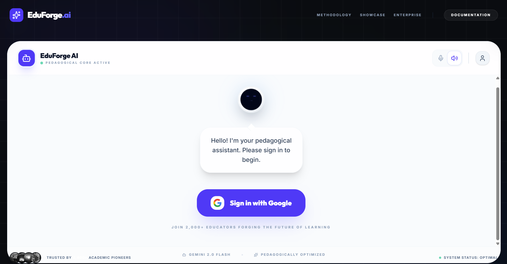
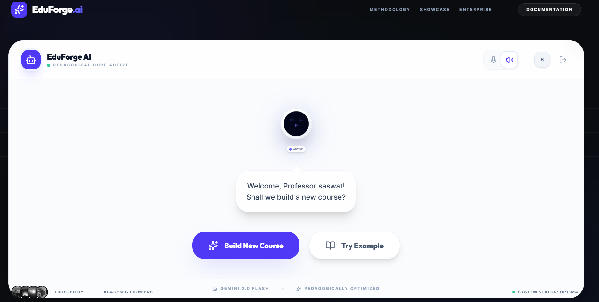
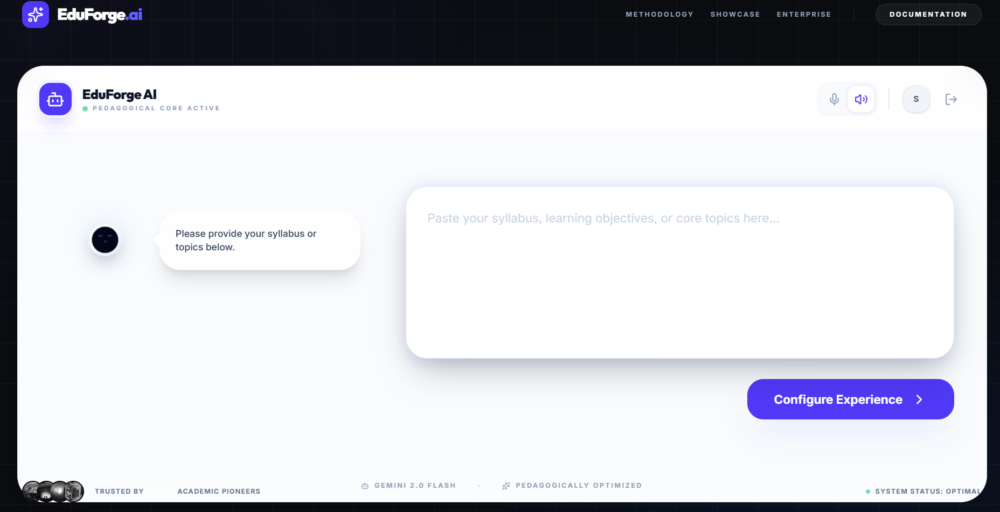
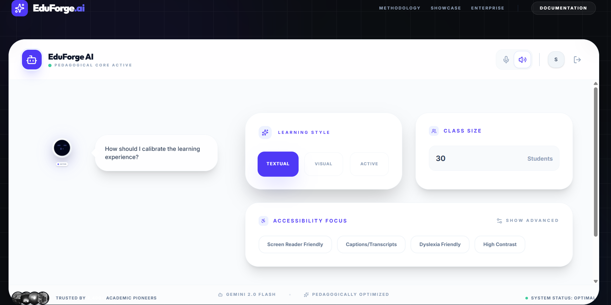
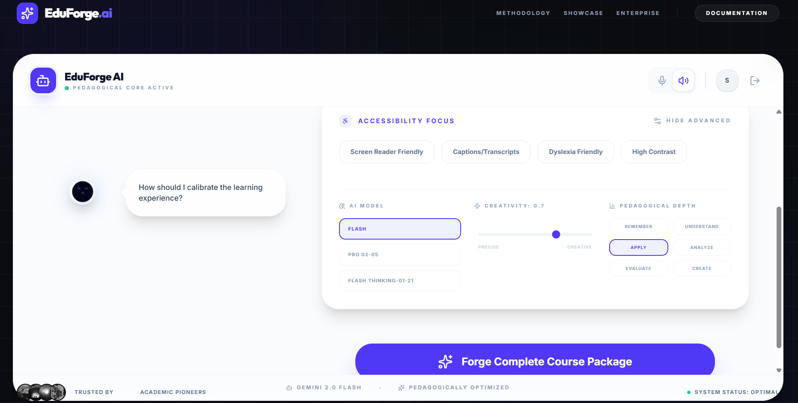
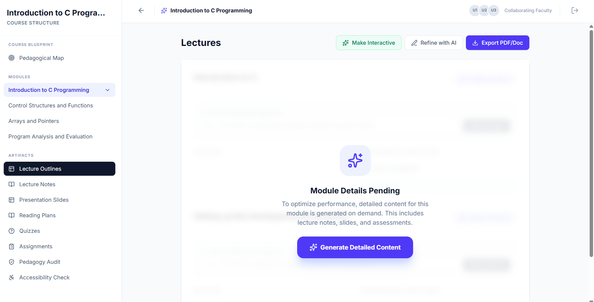

# 🚀 Ghost Terminal – AI-Assisted Course Creation

## 👥 Team Details

- **Team Number:** 8  
- **Team Name:** Ghost Terminal  

### 🧑‍💻 Team Members
- Bedaprakash Dash  
- Saswat Kumar Sahu  
- Hritesh Sahu  
- Jhasketan Mahana  
- Ritik Prasad Mahato  

## 📌 Problem Statement

**AI-Assisted Undergraduate Course & Lesson Creation**

Designing lectures, assignments, and assessments for undergraduate courses is time-consuming, repetitive, and difficult to personalize at scale. This project aims to build an AI-powered assistant that automates and enhances course creation while maintaining academic rigor.

## ✨ Key Features

### 🧠 Advanced Pedagogical Engine
- **Bloom’s Taxonomy Alignment:** Automatically categorizes learning outcomes and assessments into levels (Remember, Understand, Apply, Analyze, Evaluate, Create).
- **Universal Design for Learning (UDL):** Ensures accessibility and inclusivity in generated content.
- **Curriculum Sequencing:** Generates logical topic dependencies and prerequisite structures.

### ⚡ Optimized AI Generation
- **Two-Stage "Skeleton-First" Workflow:** Fast course structure generation with on-demand detailed expansion.
- **Multi-Model Intelligence:** Uses Google Gemini 2.0 Flash with fallback to Groq (Llama 3.3 70B) for reliability.
- **Robust JSON Extraction:** Handles AI formatting inconsistencies to ensure clean structured data.

### 📚 Comprehensive Course Artifacts
- **Adaptive Learning Versions:**
  - Visual (diagrams & spatial explanations)
  - Active (hands-on exercises & simulations)
  - Textual (step-by-step explanations)
- **Lecture & Slide Suite:** Markdown notes + presentation slides with speaker notes.
- **Smart Assessments:** MCQs with explanations, Bloom’s level tagging, and difficulty grading.
- **Curated Reading Plans:** Suggests books, articles, and videos based on topic level.

### 🛠 Interactive Teacher Tools
- **AI Refinement Loop:** Modify content using natural feedback prompts.
- **Pedagogy Audit:** Detects gaps in learning objectives and coverage.
- **Interactive Designer UI:** Built with React 19 and Tailwind CSS for smooth UX.

### 🔐 Enterprise-Ready Infrastructure
- **Firebase Integration:** Google authentication and Firestore storage.
- **Secure Backend:** Express + Vercel Functions to protect API keys.
- **Export Ready:** Generate PDFs and documents from course content.

## 🌐 Live Demo

🔗 **Try the App Here:**  
https://eduforge-ai-s5of.vercel.app/

> Experience AI-powered course generation in real-time.

## 📸 Demo Screenshots

### 🔐 Sign In Interface

### 👋 Welcome Dashboard

### 📝 Input Course Content

### ⚙️ Configure Learning Experience

### 🧠 Advanced Pedagogical Controls

### 📚 Generated Course Structure

## 🧰 Tech Stack

- **Frontend:** React 19, TypeScript, Tailwind CSS, Framer Motion, Lucide Icons  
- **Backend:** Node.js, Express, Vercel Serverless Functions  
- **Database/Auth:** Firebase Auth, Cloud Firestore  
- **AI Models:** Google Gemini 2.0 Flash, Groq (Llama 3.3 70B)  

## 💡 Vision

To empower educators by automating repetitive academic tasks and enabling personalized, high-quality learning experiences at scale.

